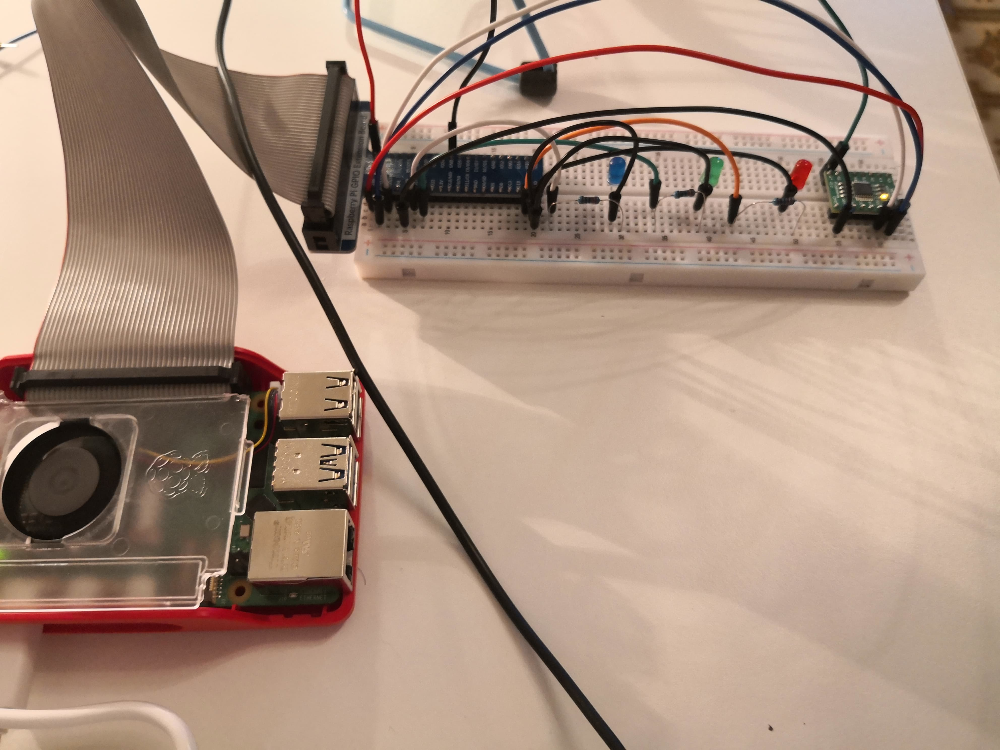
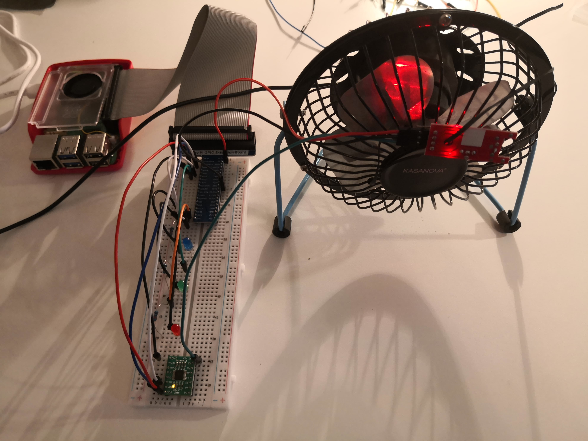
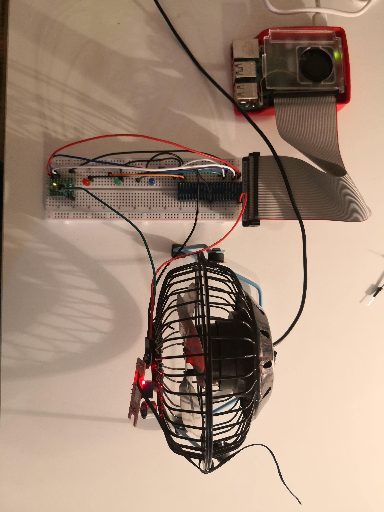
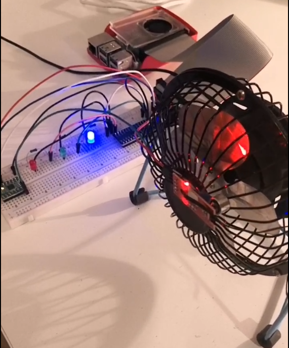
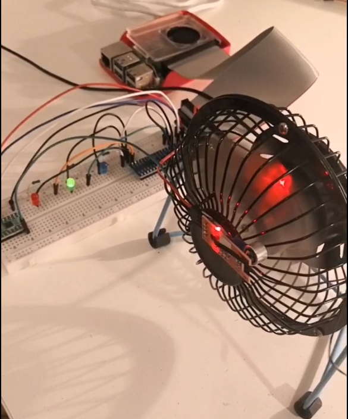
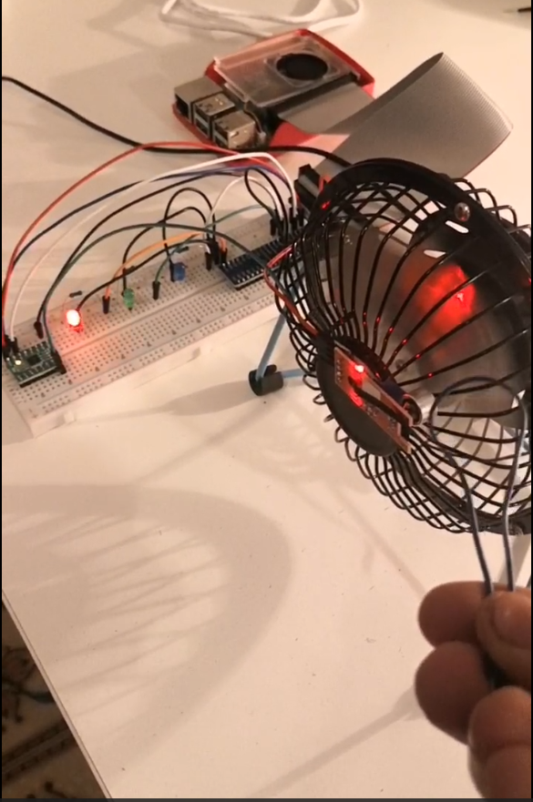

# Raspberry Pi Anomaly Detection System

A real-time anomaly detection system for Raspberry Pi that monitors sensor data and uses machine learning to detect abnormal behavior patterns. The system uses LED indicators to provide visual feedback for different states: normal operation, off state, and anomaly detection.

## Overview

This project implements a machine learning-based anomaly detection system that:
- Reads analog sensor data using ADC (Analog-to-Digital Converter)
- Extracts features from sensor signals including statistical and frequency domain features
- Uses trained machine learning models to classify states and detect anomalies
- Provides real-time visual feedback through colored LEDs
- Supports data collection for training new models

## Hardware Requirements

- Raspberry Pi (tested with models that support GPIO)
- ADC device (PCF8591 or ADS7830)
- 3 LEDs (Red, Green, Blue) with appropriate resistors
- Analog sensor connected to ADC channel 7
- Freenove Kit components (recommended)

## Wiring Setup

Based on the setup images in the repository:
- **Blue LED**: GPIO 17 (Off state indicator)
- **Green LED**: GPIO 27 (Normal operation indicator)  
- **Red LED**: GPIO 26 (Anomaly detected indicator)
- **ADC**: Connected via I2C (addresses 0x48 for PCF8591 or 0x4b for ADS7830)
- **Sensor**: Connected to ADC channel 7




## Installation

1. Clone this repository to your Raspberry Pi:
   ```bash
   git clone <repository-url>
   cd raspberrypi-anomalies-detection-test
   ```

2. Create and activate a virtual environment:
   ```bash
   python3 -m venv env
   source env/bin/activate
   ```

3. Install the required dependencies:
   ```bash
   pip install -r requirements.txt
   ```

## Usage

### Data Collection

Before running anomaly detection, you need to collect training data:

1. **Collect "off" state data**:
   ```bash
   python pi_loop_sample.py
   ```
   Edit the `state` variable in the script to `"off"` and run when your system is in the off state.

2. **Collect "on" state data**:
   ```bash
   python pi_loop_sample.py
   ```
   Edit the `state` variable in the script to `"on"` and run when your system is operating normally.

### Model Training

Train the machine learning models using the collected data:

```bash
jupyter notebook train_AD.ipynb
```

Or run all cells in the notebook to:
- Load and preprocess the collected data
- Train a K-Nearest Neighbors classifier for state classification
- Train a Local Outlier Factor model for anomaly detection
- Save the trained models and scaler to pickle files

### Real-time Monitoring

Run the main anomaly detection system:

```bash
python pi_loop.py
```

The system will:
- Continuously read sensor data
- Process the data in real-time
- Display predictions and LED status
- Show anomaly alerts when detected


Enanchements:
- reduce lag
- better anomalies detection

## How It Works

### Feature Extraction

The system extracts features from a sliding window of 10 sensor readings:
- **Statistical features**: Mean and standard deviation
- **Frequency domain features**: Fourier transform coefficients (real and imaginary parts)

### Machine Learning Models

1. **K-Nearest Neighbors Classifier**: Distinguishes between "on" and "off" states
2. **Local Outlier Factor**: Detects anomalies by identifying outliers in the feature space
3. **Standard Scaler**: Normalizes features for consistent model performance

### LED Indicators

- 🔴 **Red LED**: Anomaly detected
- 🟢 **Green LED**: Normal operation (on state)
- 🔵 **Blue LED**: Off state





## File Structure

```
├── pi_loop.py              # Main anomaly detection script
├── pi_loop_sample.py       # Data collection script
├── train_AD.ipynb          # Model training notebook
├── requirements.txt        # Python dependencies
├── on.csv                  # Training data for "on" state
├── off.csv                 # Training data for "off" state
├── knn_model.pkl          # Trained KNN classifier
├── clf_model.pkl          # Trained state classifier
├── scaler.pkl             # Fitted data scaler
├── set_up1.jpeg           # Hardware setup images
├── set_up2.jpeg
├── set_up3.jpeg
└── freenove_components.jpg # Component reference
```

## Configuration

### Model Parameters

You can adjust the following parameters in `train_AD.ipynb`:
- **LocalOutlierFactor contamination**: Currently set to 0.01 (1% of data expected to be anomalies)
- **KNN neighbors**: Set to 5 for classification, 20 for anomaly detection
- **Buffer size**: 10 samples for feature extraction window

### Sampling Rate

The system samples at 10Hz (0.1-second intervals). Modify the `time.sleep(0.1)` in `pi_loop.py` to change the sampling rate.

## Troubleshooting

### I2C Issues
```bash
# Check I2C devices
i2cdetect -y 1

# Enable I2C if not detected
sudo raspi-config
# Navigate to Interface Options > I2C > Enable
```

### GPIO Permissions
```bash
# Add user to gpio group
sudo usermod -a -G gpio $USER
# Logout and login again
```

### Missing Dependencies
```bash
# Update system packages
sudo apt update
sudo apt install python3-pip python3-venv i2c-tools

# Reinstall requirements
pip install -r requirements.txt
```

## License

This project is open source. Please refer to the license file for details.

## Acknowledgments

- Freenove Complete Starter Kit for Raspberry Pi
- scikit-learn for machine learning algorithms
- gpiozero for GPIO control
